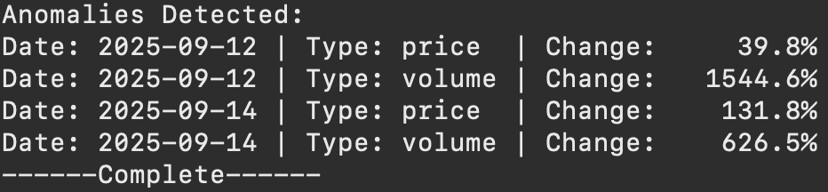

# Cryptocurrency Data Science Assessment

A Python-based solution for the cryptocurrency data science assessment, addressing both Task 1 (wallet analysis) and Task 2 (market forensics).

## Challenge Overview

This project provides solutions for two main tasks:

### Task 1: Wallet Transaction Analysis
- Fetches recent transactions (max 15) for cryptocurrency wallet address (Binance wallet)
- Creates transaction network graph visualizations (nodes = addresses, edges = transactions)

### Task 2: Market Forensics Analysis  
- Detects unusual market activity in cryptocurrency token (SynFutures chosen)
- Identifies suspicious activity like pump-and-dump schemes via analysis of price and volume anomalies

## Installation

### Prerequisites
- Python 3.8+
- Etherscan API key (free tier available)
- pip package manager

### Quick Setup
```bash
# Clone the repository
git clone https://github.com/linette-g/crypto-challenge.git
cd crypto-challenge

# Install dependencies
pip install -r requirements.txt
```

### Required API Keys

You need an **Etherscan API key** to run this project.
1. Get a free API key from [Etherscan](https://etherscan.io/myapikey).
2. Create your .env file and add your API key
```bash
# Create the .env file
touch .env
# Add your API key
echo "ETHERSCAN_API_KEY=YourActualKeyHere" > .env
```

## Example Usage
```bash
# Go into the correct directory
cd src
python transactions.py  # task 1
python analyser.py  # task 2
```

## Results

### Task 1 
Transaction Graph


### Task 2
Anomalies Graph


Printed output



## Remarks

- AI tools were used to identify tokens exhibiting unusual activity over the past 30 days ('synfuture' used as argument in part 2)

- AI tools were used to select active wallet addresses, such as Binance hot wallets to use for analysing transaction patterns ('Binance' address used as argument in part 1)

- CoinGecko API was used to retrieve corresponding historical market data using token IDs
